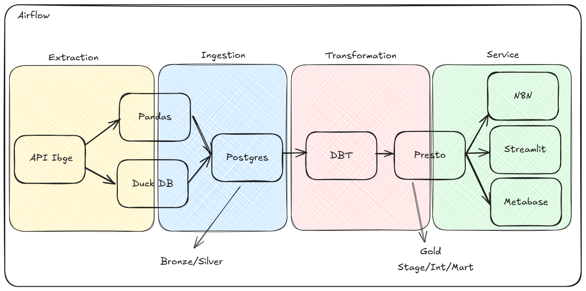

<h1 align="center"> Portfolio - Allan Ruivo </h1>
My name is Allan Ruivo Wildner. The purpose of this repository is to store projects I've developed in order to develop myself as a professional and to show what technical skills I possess.

# Summary
- [Project 1](#project-1)
  - [1. Setting up the infrastructure](#setting-up-the-infrastructure)
    - [WSL](#wsl-commands)
    - [Linux](#linux-commands)
    - [Python](#python-setup)
    - [VScode](#vscode-setup)
    - [Git Setup](#git-setup)
    - [Git Commands](#git-commands)
    - [Commits](#commits)
    - [Virtual Env](#virtual-env)
    - [Airflow](#airflow)
    - [DuckDB](#duckdb)
    - [PostgreSQL](#postgresql)
    - [N8N](#n8n)
  - [2. Data extraction from IBGE API using python](#data-extraction-from-ibge-api-using-python)
  - [3. N8N data upload, transformation and save](#n8n-data-upload-transformation-and-save)
  - [4. DBT](#dbt)
  - [5. Tasks Orchestration (Airflow)](#tasks-orchestration-airflow)
  - [6. Data Visualization](#data-visualization)


# Project 1




# Setting up the infrastructure
WSL, python, vscode, git environment, airflow, python libs, postgresql and n8n
<br>

# WSL Commands
I chose to use linux over windows WSL because my personal computer is already on this operating system and tools like tableau don't run on linux
- Enable WSL
  ```bash
  wsl --install
- Check for distributions already installed 
  ```bash
  wsl -- list --verbose
- Check available distributions to install if necessary
  ```bash
  wsl --list --online
- Install new distribution
  ```bash
  wsl --install --distribution <distro>
- Uninstall old distro
  ```bash
  wsl --unregister <distro>
- Configure a distro as default
  ```bash
  wsl --set-default <distro>
- Updates
  ```bash
  wsl --update
- Status
  ```bash
  wsl --status
- Help
  wsl --help
- Checking WSL memory
  df -h /
- Checking WSL RAM and SWAP memory
  free -h
- Changing the WSL memory size
  wsl --manage <distribution name> --resize <memory string>
- WSL deactivation
  wsl --shutdown

# Linux Commands
- View directories
  ```bash
  ls
- View hidden directories
  ```bash
  ls -a
- Go to directorie
  ```bash
  cd <path>
- Move file
  ```bash
  mv <path1> <path2>
- Delete file
  ```bash
  rm <path>
- Delete directorie
  ```bash
  rm -rf <path>
- Create directorie
  ```bash
  mkdir <directorie>
- Permission override
  ```bash
  sudo

# Python Setup
- Go to the python website and install (select the options to install as administrator and to add python.exe to the PATH variable)
- Check that python is accessible from linux using the "python" or "python3" command, otherwise go to the windows environment variable settings and add it

# VScode Setup
- Install VS Code from the microsoft store
- Activate VS Code in WSL
  ```bash
  code
- Install python extensions and WSL
- Change vs code to the WSL environment in the bottom left corner of the screen

# Git Setup
- Install git
- Github credentials configuration
  ```bash
  git config --global user.name <nome>
  git config --global user.email <email>
- In the directorie you want to turn in a git repositore
  ```bash
  git init -b <nome da branch>
- Use SSH connection to connect WSL on github
- Go to github > settings > SSH and GPH keys
- Click on New SSH Key
- On linux use the command
  ```bash
  ssh-keygen -t ed25519 -C "seuemail@email.com"
- Press enter 3 times
- Activate the key
  ```bash
  eval "$(ssh-agent -s)"
- Create the key
  ```bash
  ssh-add ~/. ssh/id_ed25519
- If this command doesn't work, use this
  ```bash
  nano ~/.
- If you need to bring a repository that already exists to vscode
  ```bash
  git clone <repository url>

# Git Commands
- Checking the status of commits
  ```bash
  git status
- Add files to the commit
  ```bash
  git add <file1> <file2> <fileN>
- Add all the files to the commit
  ```bash
  git add -A
- Commiting
  ```bash
  git commit -m <message>
- Commit history on this branch
  ```bash
  git log
- Commit history on all branches
  ```bash
  git log -all
- Branch list
  ```bash
  git branch
- Create branch
  ```bash
  git branch <new branch>
- Change branch
  ```bash
  git checkout <branch> 
- Change branch and create a new one
  ```bash
  git checkout -b <branch>
- To merge (you must be in the target branch and if you need to cancel, use the same command with --abort)
  ```bash
  git merge <branch origem>
- Change commit
  ```bash
  git checkout <hash commit>
- Sending commits to a remote repository
  ```bash
  git push <repository> < branch>
- List of connected remote repositories
  ```bash
  git remote -V
- Connects to a remote repository
  ```bash
  git remote add origin <url>
- Delete branch
  ```bash
  git push <remote branch> -d <local branch>
- Downloading files from the remote repository to the remote branches
  ```bash
  git fetch
- Integrates files from the remote branch with the local branch
  ```bash
  git pull
- Reapply commits to another branch
  ```bash
  git rebase <destination branch>
- Remove files from the commit stage
  ```bash
  git restore --staged  <file1> <file2>

# Commits
- To standardize the commits I used the commitizen library
  ```bash
  pip install -U commitizen
- When committing with the command below, it offers some commit configuration possibilities
  ```bash
  cz commit

# Virtual Env
- In the repository create a python virtual environment
  ```bash
  python3 -m venv <enviroment>
- To activate the env use this command
  ```bash
  source <path>/bin/activate
- To deactivate use
  ```bash
  deactivate
- To install libraries in the env use or install directly from pip
  ```bash
  pip install -r <requirements path>

# Airflow
- Installing airflow
  ```bash
  pip install "apache-airflow[celery]==3.0.2" --constraint "https://raw.githubusercontent.com/apache/airflow/constraints-3.0.2/constraints-3.9.txt"
- Activating
  ```bash
  airflow api-server -p 8080
- Installing duckdb with ariflow
  ```bash
  pip install apache-airflow[duckdb]

# DuckDB
- Installing duckdb
  ```bash
  pip install duckdb

# PostgreSQL
- Installing PostgreSQL
  ```bash
  sudo apt install -y wget ca-certificates
  wget -O - https://www.postgresql.org/media/keys/ACCC4CF8.asc | sudo apt-key add -
  echo "deb http://apt.postgresql.org/pub/repos/apt $(lsb_release -cs)-pgdg main" | sudo tee /etc/apt/sources.list.d/pgdg.list
  sudo apt update
  sudo apt install -y postgresql-14
- Checking for an active cluster
  ```bash
  pg_lsclusters
- Changing user to postgreSQL
  ```bash
  sudo -i -u postgres
- Opening postgreSQL
  ```bash
  psql -U postgres -p 5432
- Create schema
  ```bash
  CREATE SCHEMA schema_name;
- Create database
  ```bash
  CREATE DATABASE my_bank -- Name of the database to be created.
     WITH OWNER = my_user -- Server user who will be the owner of the database.
          TEMPLATE = template1 -- Database that will be used as a template for creating the new database.
          ENCODING = ‘UTF8’ -- Type of encoding for the data that will be stored in the database.
          TABLESPACE = pg_default -- Tablespace where the database will be physically created.
          CONNECTION LIMIT = 100; -- Maximum number of simultaneous connections allowed in the database.
- Create table
  ```bash
  CREATE TABLE my_table -- Name of the table
  (
      <field1> <data type>, 
      <field2> <data type>, 
      <field3> <data type>
  );
- Create user
  ```bash
  CREATE ROLE my_user WITH LOGIN PASSWORD 'my_password' SUPERUSER CREATEDB CREATEROLE;
- Help
  ```bash
  \h
- Return
  ```bash
  \q
- View databases
  ```bash
  \l
- View schemas
  ```bash
  \dn
- View tables
  ```bash
  \dt
- Exit
  ```bash
  exit
- Enter database
  ```bash
  \c nome_do_banco
- Delete table
  ```bash
  DROP TABLE nome_da_tabela;

# N8N
- Installing NodeJS
  ```bash
  sudo apt install nodejs
- Installing NPM
  ```bash
  sudo apt install npm
- Installing N8N
  ```bash
  npm install n8n -g
- Opening N8N
  ```bash
  n8n

# Data extraction

[Extract](project1/pipeline/1.extraction/)

# Data ingestion

[Ingestion](project1/pipeline/2.ingestion/)

# N8N data upload, transformation and save


[Workflow](project1/pipeline/3.transformation/n8n/n8n_workflow.json)

[Trigger](project1/pipeline/3.transformation/n8n/n8n_request.py)

# DBT

- DBT Installing
  ```bash
  pip install dbt-postgres
- Configuration
  ```bash
  dbt init
- Check configuration
  ```bash
  dbt debug
- Editing profiles.yml
  ```bash
  cd ~/.dbt
  nano profiles.yml
- Run the models without tests (--select to select a specific model)
  ```bash
  dbt run
- Run all objects (--select to select a specific object)
  ```bash
  dbt build
- Test the models (--select to select a specific model)
  ```bash
  dbt test
- Import the seeds file to the database (--select to select a specific model)
  ```bash
  dbt seed

# Streamlit
- Installing
  ```bash
  pip install streamlit psycopg2-binary plotly

# Tasks Orchestration (Airflow)


# Data Visualization


# Project 2

# Installing docker
- Instalando utilitarios do gerenciador de pacotes do linux
sudo apt update && sudo apt install -y software-properties-common
- Atualizando o apt e todos os pacotes
sudo apt upgrade -y
- Instalando o docker
sudo apt install -y docker.io
- Iniciando o docker
sudo systemctl start docker
- Para que o docker inicie junto com o sistema
sudo systemctl enable docker

# Creating EC2
- Instale o AWS CLI fora do seu repositorio
  ```bash
  curl "https://awscli.amazonaws.com/awscli-exe-linux-x86_64.zip" -o "awscliv2.zip"
  unzip awscliv2.zip
  sudo ./aws/install
- Na AWS configure um usuario IAM com acesso a sua conta
- No terminal use o comando
  ```bash
    aws configure sso
    SSO session name (Recommended): <nome da sessao>
    SSO start URL [None]: <link disponivel no IAM>
    SSO region [None]: <regiao AWS>
    SSO registration scopes [None]: sso:account:access
- Criar EC2 configurando chave ssh
- Ajustar regras de grupo de segurança
- Conecte na EC2 (cada AMI possui um nome de usuario padrão)
  ```bash
  ssh -i <key path> <user>@<link EC2>