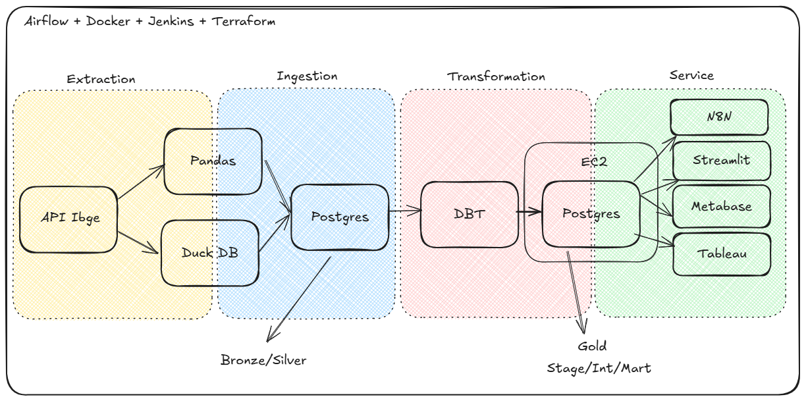

# Portfolio - Allan Ruivo Wildner
Welcome! My name is Allan Ruivo Wildner, and this repository is intended to present my portfolio of personal projects. Here, you will find the projects I have developed throughout my journey of learning and professional growth in the field of technology.

# Summary
- [Useful Knowledge](#useful-knowledge)
- [Project 1](#project-1)

# Useful Knowledge

<details>

<summary> Using WSL: Key Steps and Commands </summary>

**WSL** (Windows Subsystem for Linux) lets you run a full Linux environment directly on Windows without using a virtual machine or dual boot.

Here’s a quick guide to setting up and managing **WSL (Windows Subsystem for Linux)**, along with some essential commands:

- `wsl --install` — Enables WSL on Windows.  
- `wsl --list --verbose` — Lists all installed Linux distributions with detailed info.  
- `wsl --list --online` — Shows available distributions you can install.  
- `wsl --install --distribution <distro>` — Installs a specific Linux distribution.  
- `wsl --unregister <distro>` — Uninstalls a distribution.  
- `wsl --set-default <distro>` — Sets the default distribution for WSL sessions.  
- `wsl --update` — Updates the WSL system.  
- `wsl --status` — Displays the current WSL configuration and status.  
- `wsl --help` — Opens the help menu with a list of all commands.  
- `df -h /` — Shows disk usage within the Linux environment.  
- `free -h` — Displays memory and swap usage.  
- `wsl --manage <distro> --resize <memory>` — Adjusts the memory limit for a distribution.  
- `wsl --shutdown` — Gracefully shuts down all running WSL instances.
</details>
<details>
<summary> Basic Linux Commands </summary>

**Linux** is a free, open-source operating system known for its stability, security, and use across servers, desktops, and embedded systems.

Here are some commonly used Linux commands for navigating and managing files and directories:

- `ls` — Lists directories and files in the current path.  
- `ls -a` — Shows hidden files and directories.  
- `cd <path>` — Navigates to the specified directory.  
- `mv <source> <destination>` — Moves or renames a file or directory.  
- `rm <file>` — Deletes a specific file.  
- `rm -rf <directory>` — Deletes a directory and its contents recursively.  
- `mkdir <directory>` — Creates a new directory.  
- `sudo` — Runs a command with superuser (admin) privileges.
- `chmod` — Aumentar a permissão de um arquivo. 
</details>
<details>
<summary> Python Setup </summary>

**Python** is a versatile, high-level programming language known for its readability and wide range of applications.

- Download and install Python from the official website. 
  During installation, make sure to:
  - Run the installer as administrator.
  - Select the option to **add Python to the system PATH**.
- After installation, verify that Python is accessible from your WSL environment by running `python` or `python3`.  
  If the command is not recognized, add the Python installation path manually via **Windows Environment Variables**.
</details>
<details>

<summary> Python Virtual Environment Setup </summary>

A **Python virtual environment** is an isolated folder that lets you manage dependencies for a specific project without affecting others.

- `python3 -m venv <env_name>` — Create a virtual environment in your project directory.
- `source <env_name>/bin/activate` — Activate the environment.
- `deactivate` — Deactivate the environment.
- `pip install -r <path_to_requirements.txt>` — Install dependencies from a requirements.txt file or directly via pip.
- `pip freeze > requirements.txt` — Create requirements.txt.
</details>
<details>

<summary> VS Code Setup </summary>

**Visual Studio Code** (VS Code) is a lightweight, open-source code editor with built-in support for debugging, version control, and extensions across many programming languages.

- Install **Visual Studio Code** from the Microsoft Store.
- `code` — Run it int VS Code **WSL terminal**.
</details>
<details>

<summary> Git Setup </summary>

**Git** is a free and open-source distributed version control system that allows developers to track changes in source code, collaborate on projects, and manage different versions of files efficiently and securely.

- `sudo apt update && sudo apt install git -y` — Install Git.
- `git config --global user.name "<your_name>"` — Configure github name credential.
- `git config --global user.email "<your_email>"` — Configure github email credential.
- `git init -b <branch_name>` — To transform a local repository in a remote repository.
- Set up SSH authentication for GitHub: Go to GitHub → Settings → SSH and GPG Keys → click New SSH Key.
- ssh-keygen -t ed25519 -C "your_email@example.com" — Generate a ssh key.
> (Press Enter three times to accept the defaults)
- `eval "$(ssh-agent -s)"` — Start the SSH agent.
- `ssh-add ~/.ssh/id_ed25519` — Add the SSH private key to the agent.
- `cat ~/.ssh/id_ed25519.pub` — View the public key.
> Paste the copied key into GitHub when creating the new SSH Key.
- `git clone <repository_url>` — Clone an existing repository into VS Code.
</details>
<details>

<summary> Git Commands </summary>

- `git status` — Checks the current status of your working directory and staging area.  
- `git add <file1> <file2> <fileN>` — Adds specific files to the staging area.  
- `git add -A` — Adds all changes (new, modified, deleted files) to the staging area.  
- `git commit -m "<message>"` — Commits staged changes with a message.  
- `git log` — Shows the commit history of the current branch.  
- `git log --all` — Displays the commit history across all branches.  
- `git branch` — Lists all local branches.  
- `git branch <new-branch>` — Creates a new branch.  
- `git checkout <branch>` — Switches to an existing branch.  
- `git checkout -b <branch>` — Creates and switches to a new branch.  
- `git merge <source-branch>` — Merges a branch into the current one.  
  > To cancel a merge in progress, use `git merge --abort`.  
- `git checkout <commit-hash>` — Navigates to a specific commit (detached HEAD).  
- `git push <remote> <branch>` — Sends local commits to a remote branch.  
- `git remote -v` — Lists the connected remote repositories.  
- `git remote add origin <url>` — Connects your local repo to a remote one.  
- `git push <remote> --delete <branch>` — Deletes a remote branch.  
- `git fetch` — Downloads changes from the remote repository without merging.  
- `git pull` — Fetches and merges changes from the remote repository into the current branch.  
- `git rebase <target-branch>` — Reapplies commits on top of another branch.  
- `git restore --staged <file1> <file2>` — Unstages files that were added with `git add`.
</details>
<details>
<summary> Commit Standardization (Commitizen) </summary>

To standardize commit messages, you can use the [**Commitizen**] library:

- `pip install -U commitizen` — Install commitizen.
- `cz commit` — Use interactive commit formatting.
</details>
<details>

<summary> AWS CLI </summary>

The **AWS CLI (Command Line Interface)** is a tool that lets you manage and automate AWS services directly from your terminal using simple text commands.

- `curl "https://awscli.amazonaws.com/awscli-exe-linux-x86_64.zip" -o "awscliv2.zip"`  — Dowload the installation package.
- `unzip awscliv2.zip` — Unzip the file.
- `sudo ./aws/install` — Install the AWS CLI.
- In your AWS account, configure an IAM user with the necessary permissions.
- `aws configure sso` — Configure SSO
> Provide the following details when prompted:
  SSO session name (Recommended): <session_name>
  SSO start URL [None]: <IAM_start_URL>
  SSO region [None]: <AWS_region>
  SSO registration scopes [None]: sso:account:access
- `aws sso login --profile default` — Log in to your AWS session.
</details>
<details>

<summary> Terraform Setup </summary>

**Terraform** is an open-source Infrastructure as Code (IaC) tool that allows you to provision, manage, and version cloud infrastructure using declarative configuration files.

- `sudo apt-get install terraform` — Install terraform.
- `terraform init` — Initialize your Terraform project (downloads necessary providers and sets up the working directory). 
- `terraform plan` — Create an execution plan (previews changes without applying them).
- `terraform apply` — Apply the configuration to provision the infrastructure.
</details>
<details>

<summary> AWS EC2 Instance </summary>

**Amazon EC2 (Elastic Compute Cloud)** is a scalable virtual server service that allows you to run applications in the cloud. It's commonly used to host websites, run backend services, or test environments on-demand.

To deploy an EC2 instance using **Terraform**, refer to the [main.tf](project1/infra/) file in this repository, which defines all necessary infrastructure as code.

**Manual Steps (if needed):**

- Create an EC2 instance via the AWS Console, making sure to configure an **SSH key pair** during setup.  
- Configure **Security Group rules**, such as opening port 22 for SSH access.
- `ssh -i ~/.ssh/ec2-key.pem ec2-user@<ec2-public-dns>` — Connect to the EC2 instance (each AMI has a default username).
</details>
<details>

<summary> PostgreSQL </summary>

**PostgreSQL** is a free and open-source relational database management system known for its reliability, extensibility, and full compliance with SQL standards.

> Adjustments necessary to enable remote access to your PostgreSQL instance on EC2:
  Enabled external listening Updated postgresql.conf by setting: listen_addresses = '*' (remove "#")
  Allowed external connections Edited pg_hba.conf to add: host all all 0.0.0.0/0 md5
  Restarted PostgreSQL Applied config changes by restarting the PostgreSQL service.
  Opened firewall access Ensured EC2's Security Group allows inbound traffic on port 5432 from your IP or all IPs (for testing).
  Verified PostgreSQL is running and listening externally Used netstat to confirm it's listening on 0.0.0.0:5432.
  Corrected credentials and connection IP Fixed host IP and confirmed that the database, user, and permissions were properly set.

- `sudo apt update && sudo apt install -y postgresql-14` — Install PostgreSQL.
- `pg_lsclusters` — Check for an active cluster.
- `psql -U user -d database` — Open postgreSQL (default database = postgres).
- `psql -U user -d database` — Open postgreSQL.
- `CREATE SCHEMA schema_name;` — Create schema.
- `CREATE DATABASE my_bank WITH OWNER = my_user TEMPLATE = template1 ENCODING = ‘UTF8’ TABLESPACE = pg_default CONNECTION LIMIT = 100;` — Create database.
- `CREATE TABLE my_table (<field1> <data type>, <field2> <data type>, <field3> <data type>);` — Create table.
- `CREATE ROLE my_user WITH LOGIN PASSWORD 'my_password' SUPERUSER CREATEDB CREATEROLE;` — Create user.
- `\h` - Help.
- `\q` - Return.
- `\l`- View databases.
- `\dn` - View schemas.
- `\dt` - view tables.
- `exit` - Exit.
- `\c database`- Enter database.
- `DROP TABLE nome_da_tabela;` — Delete table.
- `sudo nano /var/lib/pgsql/data/postgresql.conf` — Check configurations.
- `cd /tmp && sudo -u postgres pg_ctl reload -D /var/lib/pgsql/data` — Reload config files.
- `sudo nano /var/lib/pgsql/data/pg_hba.conf` — Checking host-base authentication.
- `sudo systemctl restart postgresql` — Restarting postgreSQL.
- `\du` — View users.
</details>
<details>

<summary> DBT </summary>

**dbt** (data build tool) is a command-line tool that enables data teams to transform, test, and document data in the warehouse using modular SQL and software engineering practices.

- Install DBT:
  ```bash
  pip install dbt-postgres
- Configure:
  ```bash
  dbt init
- Check configuration:
  ```bash
  dbt debug
- Editing profiles.yml (The profiles.yml file in dbt (data build tool) is a configuration file that stores the connection settings needed for dbt to access your data warehouse):
  ```bash
  cd ~/.dbt
  nano profiles.yml
- Run the models without tests (--select to select a specific model):
  ```bash
  dbt run
- Run all objects (--select to select a specific object):
  ```bash
  dbt build
- Test the models (--select to select a specific model):
  ```bash
  dbt test
- Import the seeds file to the database (--select to select a specific model):
  ```bash
  dbt seed
- Update dbt
  ```bash
  pip install --upgrade dbt-core
- Use the `dbt build` command to run all the dbt models, thus creating all the tables with their metadata according to the SQL queries defined.
</details>
<details>

<summary> Docker </summary>

sudo apt remove docker docker-engine docker.io containerd runc
sudo apt update
sudo apt install -y ca-certificates curl gnupg lsb-release

# Adiciona a chave GPG
sudo mkdir -m 0755 -p /etc/apt/keyrings
curl -fsSL https://download.docker.com/linux/ubuntu/gpg | sudo gpg --dearmor -o /etc/apt/keyrings/docker.gpg

# Adiciona o repositório Docker oficial
echo \
  "deb [arch=$(dpkg --print-architecture) signed-by=/etc/apt/keyrings/docker.gpg] \
  https://download.docker.com/linux/ubuntu \
  $(lsb_release -cs) stable" | \
  sudo tee /etc/apt/sources.list.d/docker.list > /dev/null

# Atualiza e instala o Docker Engine
sudo apt update
sudo apt install -y docker-ce docker-ce-cli containerd.io docker-buildx-plugin docker-compose-plugin

Dar permissão para usuario executar o docker
sudo usermod -aG docker $USER

- Comando para ativar o docker
  docker compose up
- Comando para desativar o docker
  docker compose down

  - Verificar se containers estão rodando: docker compose -f docker_compose.yml ps
- Use este comando para verificar os logs
  docker compose -f docker_compose.yml logs -f docker_name
- Para acessar o terminal de um docker
  docker exec -it docker-airflow-webserver-1 bash
</details>
<details>

<summary> Airflow </summary>

**Apache Airflow** is an open-source platform used to programmatically author, schedule, and monitor workflows—especially data pipelines—by defining them as code using Python.

- Install Airflow with Celery Executor (version pinned with constraints):
  ```bash
  pip install "apache-airflow[celery]==3.0.2" --constraint "https://raw.githubusercontent.com/apache/airflow/constraints-3.0.2/constraints-3.9.txt"
- Start the Airflow API server (default port is 8080; use -p to specify another):
  ```bash
  airflow api-server -p 9090
- Access Airflow via the following URL: `localhost:9090`
- Install the Airflow + Jenkins integration provider:
  ```bash
  pip install apache-airflow-providers-jenkins
- Set the `SQL_ALCHEMY_CONN` to connect Airflow to a remote PostgreSQL (EC2):
  ```bash
  export AIRFLOW__DATABASE__SQL_ALCHEMY_CONN=postgresql+psycopg2://airflow:sua_senha_segura@<ip-da-ec2>:5432/airflow
- nstall the async PostgreSQL client library:
  ```bash
  pip install asyncpg
- pip install apache-airflow[cncf.kubernetes]
  ```bash
  pip install apache-airflow[cncf.kubernetes]
- Redirect Airflow to your custom DAGs folder:
  ```bash
  export AIRFLOW__CORE__DAGS_FOLDER=/caminho/completo/para/sua/pasta/dags
- Disable DAG filename filtering (allows DAGs without "dag"/"airflow" in the filename):
  ```bash
  export AIRFLOW__CORE__DAG_DISCOVERY_SAFE_MODE=False
- Allow API connection
  ```bash
  export AIRFLOW__API__AUTH_BACKENDS: airflow.api.auth.backend.basic_auth
- Prevent Airflow from loading example DAGs on startup:
  ```bash
  export AIRFLOW__CORE__LOAD_EXAMPLES=False
- `echo $VARIABLE_NAME`Use this command to check the value of an environment variable.
- If the Airflow UI fails to load, install this dependency:
  ```bash
  pip install flask-appbuilder
- Airflow requires several parallel processes — run them after the API server:
  - DAG Processor:
  ```bash
  airflow dag-processor
  ```
  - Scheduler:
  ```bash
  airflow scheduler
  ```
  - Dag Trigger:
  ```bash
  airflow triggerer
  ```
  - Airflow worker:
  ```bash
  airflow celery worker
  ```
  - To kill a running process if needed (replace <process> with the name or pattern):
  ```bash
  pkill -f <"process">
  ```
  - If a port is already in use, find and release it:
  ```bash
  `lsof -i :<port>`
  `kill -9 <pid>`
  ``` 
- `airflow dags list` use to list all discovered DAGs.
- `airflow dags unpause <dag>` to unpause (activate) a specific DAG.
- Python script to verify DAG imports manually:
  ```bash
  from airflow.models import DagBag
  dagbag = DagBag()
  dagbag.dags.keys()
  dagbag.import_errors
  ```
- Verificar se airflow encontrou as dags
  docker exec docker-airflow-webserver-1 ls /opt/airflow/dags
- Verificar erros de importação das dags
  docker exec -it docker-airflow-webserver-1 airflow dags list-import-errors
</details>
<details>

<summary> Jenkins </summary>

**Jenkins** is an open-source automation server that helps developers build, test, and deploy their software continuously. In this project, we will only use jenkins to perform a manual execution of the airflow dags.

- Create the keyrings folder (for secure APT keys):
  ```bash
  sudo mkdir -p /etc/apt/keyrings
- Updating system packages:
  ```bash
  sudo apt update && sudo apt upgrade
- Install Java (required by Jenkins):
  ```bash
  sudo apt install openjdk-17-jdk
- Configurate Jenkins repository key:
  ```bash
  curl -fsSL https://pkg.jenkins.io/debian/jenkins.io-2023.key | gpg --dearmor | sudo tee /etc/apt/keyrings/jenkins.gpg > /dev/null
- Dowload and register the Jenkins repository:
  ```bash
  echo "deb [signed-by=/etc/apt/keyrings/jenkins.gpg] https://pkg.jenkins.io/debian binary/" | sudo tee /etc/apt/sources.list.d/jenkins.list > /dev/null
- Update APT sources and install Jenkins:
  ```bash
  sudo apt update
  sudo apt install jenkins
- Start Jenkins to run at boot:
  ```bash
  sudo systemctl start jenkins
- Access Jenkins using your browser at: http://localhost:8080
- Check the initial admin password (required for first login):
  sudo cat /var/lib/jenkins/secrets/initialAdminPassword
- Dowload the Jenkins CLI:
  wget http://localhost:8080/jnlpJars/jenkins-cli.jar
- Test the CLI connection and list available commands:
  java -jar jenkins-cli.jar -s http://localhost:8080/ help
- Use este comando para pegar a senha do jenkins:
  docker exec docker-jenkins-1 cat /var/jenkins_home/secrets/initialAdminPassword
</details>
<details>

<summary> Metabase </summary>
</details>
<details>

<summary> Streamlit </summary>

**Streamlit** is an open-source Python framework that allows you to quickly build and share interactive web apps for data science and machine learning projects using simple Python scripts.

- Install streamlit
  ```bash
  pip install streamlit psycopg2-binary plotly
</details>
<details>

<summary> N8N </summary>

**N8N** is an open-source workflow automation tool that lets you connect apps, services, and custom logic to automate tasks and data flows—without needing to write full applications.

- Installing NodeJS
  ```bash
  sudo apt install nodejs
- Installing NPM
  ```bash
  sudo apt install npm
- Installing N8N
  ```bash
  npm install n8n -g
- Opening N8N
  ```bash
  n8n
</details>

# Project 1 

**Project 1** is a personal initiative focused on strengthening my skills with a variety of tools and applying them **in practice**. The project involved the following key steps:
- Extracting data from the IBGE API and modeling it using a star schema.
- Storing the data in a remote environment.
- Making the data accessible in different formats.
- Automating the process with terraform+airflow+jenkins.

Automation proccess:
  1. Using terraform create the EC2 instance with PostgresSQL.
  2. Using docker create 5 containers with the applications: postgreSQL, airflow Webserver, airflow scheduler, airflow database and jenkins.
  3. use this infrastructure to run the dag using jenkins as a trigger. The dag contains the 4 stages of execution: extraction, ingestion, transformation and service.
  4. Everything will be executed through .sh files.

The tech stack included: PostgreSQL, EC2, Airflow, Terraform, Streamlit, Metabase, Tableau, DBT, Jenkins and n8n.

Project:


Dimensional model:


## Steps

1. Using linux bash install the applications necessaire: AWS CLI, Python, VS Code, Terraform, Docker, DBT, Tableau e N8N. 
> I chose to work with Linux to deepen my understanding of the operating system. However, I opted for WSL (Windows Subsystem for Linux) to maintain compatibility with essential tools like Tableau, which aren't supported on Linux.
2. Create the file [population_extraction.py](project1/pipeline/1.extraction/population_extraction.py) to extract the data from the ibge api and stores it in duckdb.
3. Create the file [main.tf](project1/infra/main.tf) with the specifications of the remote environment you want to create.
4. Create the file [population_ingestion.py](project1/pipeline/2.ingestion/population_ingestion.py) in python to import the data from duckdb to a postgreSQL in a remote EC2 environment.
5. Creathe DBT models transforming the data:[DBT models folder](project1/pipeline/3.transformation/dbt_project1/models/)
6. - Create an file [app.py](project1/pipeline/4.service/streamlit/app.py) defining the connections and visualisation options you want to build.
> Connect your github account to streamlit indicating where it should look for the file and wait for it to run.

> To avoid leaking credentials, set up variables within the streamlit application.

7. Metabase
8. Tableau
9. N8N:[Workflow](project1/pipeline/3.transformation/n8n/n8n_workflow.json) [Trigger](project1/pipeline/3.transformation/n8n/n8n_request.py)
> Workflow design

10. Create the files [docker_compose.yml](project1/infra/docker/docker_compose.yml) and [Dockerfile](project1/infra/docker/Dockerfile) to activate airflow.
11. Create the file [start_project1.sh](project1/start_project1.sh) para que execute todas estas etapas com um unico comando.
12. Use o jenkins como gatilho para executar a dag. [jenkinsfile](project1/jenkinsfile) e [airflow_pipeline.sh](project1/airflow_pipeline.sh)
> In jenkins the process should appear like this:

> In the airflow the dag should appear like this:


